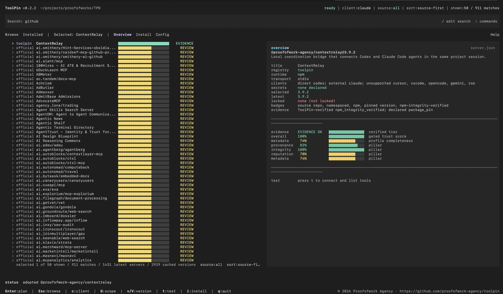
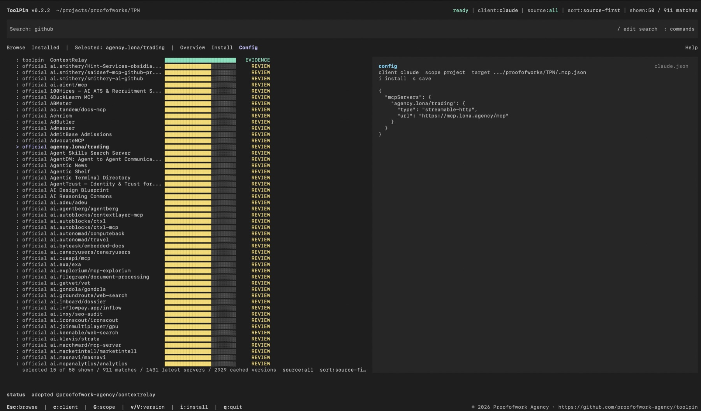
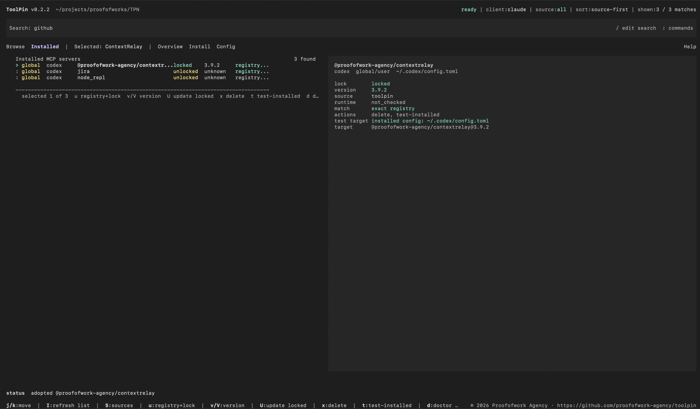
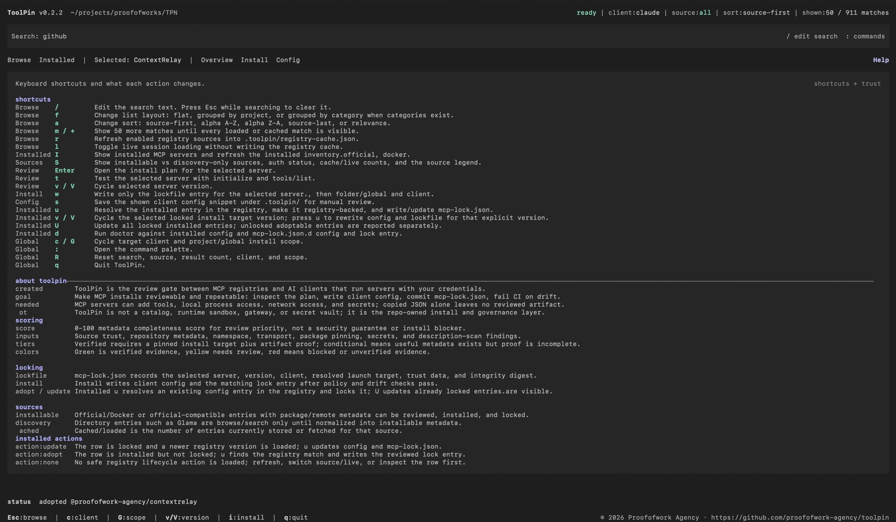

# ToolPin

[](https://github.com/proofofwork-agency/toolpin/actions/workflows/ci.yml)
[](LICENSE)
[](https://www.npmjs.com/package/@proofofwork-agency/toolpin)
[](https://github.com/proofofwork-agency/toolpin/releases)

ToolPin is a review gate for MCP server installs - a lockfile for what your
agent actually sees and runs. It verifies what it can about a server's
artifact (npm SRI, OCI digest, MCPB hash), hashes the live tool surface the
agent reads at connection time - tool names, descriptions, and input
schemas - writes correct client config, commits all of it to an enforcing
`mcp-lock.json`, and fails CI when any of it drifts.

NSA and OWASP guidance for MCP prescribes exactly this control - pin server
versions, hash tool definitions, alert on drift. ToolPin implements it as one
command: `toolpin init ci`.

The lockfile is not proprietary: it is documented as a
[vendor-neutral draft specification](docs/spec/mcp-lockfile-v1.md) with JSON
Schemas and byte-exact test vectors, so other tools can produce, read, and
enforce the same format.

Use `toolpin` for explicit commands or the shorter `tpn` alias for daily work.

Public documentation: <https://proofofwork-agency.github.io/toolpin/>

ToolPin is pre-1.0 beta software, Apache-2.0 licensed, and requires Node.js 24
or newer.



## Contents

- [Highlights](#highlights)
- [Screenshots](#screenshots)
- [Why ToolPin](#why-toolpin)
- [Getting Started](#getting-started)
- [Usage](#usage)
  - [The 30-second version](#the-30-second-version)
  - [Three interfaces, one engine](#three-interfaces-one-engine)
  - [Command overview](#command-overview)
  - [Everyday flows](#everyday-flows)
  - [Guided interactive CLI](#guided-interactive-cli)
  - [Full-screen TUI](#full-screen-tui)
- [The CI Gate](#the-ci-gate)
  - [What `toolpin ci` enforces](#what-toolpin-ci-enforces)
  - [One command to protected](#one-command-to-protected)
  - [GitHub Action inputs](#github-action-inputs)
  - [Hardened examples](#hardened-examples)
  - [Machine-readable output](#machine-readable-output)
- [The Lockfile Standard](#the-lockfile-standard)
- [Safety Model](#safety-model)
- [What Exists Now](#what-exists-now)
- [Roadmap](#roadmap)
- [Contributing](#contributing)
- [License](#license)
- [Resources](#resources)

## Highlights

- **An enforcing lockfile:** `mcp-lock.json` records the reviewed artifact,
  the live tool-surface hash, and the generated config - with per-entry
  integrity and optional ed25519 signatures. CI rejects drift in any of them.
- **Input-schema pinning (rug-pull defense):** the tool-surface hash covers
  tool names, descriptions, *and input schemas*. A server that quietly widens
  a tool's parameters after you approved it fails your build - the
  post-approval drift that file-pinning package managers and name-based
  allowlists cannot see.
- **One command to protected:** `toolpin init ci` writes a minimal,
  least-privilege GitHub workflow plus a starter policy, and refuses to
  scaffold a repo that has no lockfile yet.
- **Three-verdict output:** every server is `verified`, `needs-review`, or
  `blocked`, with the reason. `--explain` shows the full evidence when you
  want it.
- **An open standard:** the lockfile format is a
  [vendor-neutral draft spec](docs/spec/mcp-lockfile-v1.md) with published
  JSON Schemas, byte-exact digest/signature test vectors, and conformance
  classes - designed to outlive any single implementation, including this one.
- **One lockfile across clients:** correct config for Claude, Cursor, VS Code,
  Codex, OpenCode, Continue, Gemini CLI, and more - reviewed once, written
  everywhere.
- **Registry-aware, registry-neutral:** reads the Official MCP Registry,
  Docker MCP Catalog, the ToolPin curated registry, and custom registries; it
  is a verification layer over them, not a competing catalog.
- **Local policy gate:** minimum verdict floor, source/client allow/deny
  rules, remote endpoint rules, required-secret rules, and pinning
  requirements - enforced at install and in CI. `toolpin policy init
  --recommended` writes a real starter policy instead of a silent no-op.
- **Three interfaces:** a scriptable CLI, a guided interactive flow
  (`toolpin i`), and a full-screen terminal UI (`toolpin tui`) - all driving
  the same review/lock/verify engine.

## Screenshots

ToolPin gives MCP installs the same review loop teams already expect for code:
inspect the server, verify the evidence, preview the exact client config, then
write a lockfile that CI can enforce.



The TUI is built for repeated operations: source-aware browsing, registry/cache
state, trust scoring, version selection, installed inventory, config preview,
and one-key install/adopt/update/delete flows.

| Config preview | Installed inventory |
|---|---|
|  |  |



## Why ToolPin

Adding an MCP server is not like installing an editor theme. It can give an
agent new tools, local process access, network access, and credentials. Today
that decision is often a copied JSON snippet with no reviewed artifact and no
CI check that says "this is still the server and config we approved."

The failure modes are no longer theoretical: postmark-mcp shipped an email
BCC backdoor in a patch release, mcp-remote had a CVSS 9.6 RCE
(CVE-2025-6514), and the quietest one - the rug pull - needs no new release
at all: a server you approved changes its tool descriptions or input schemas
upstream, your agent reads them live at the next connection, and nothing in
your repo changed. MCP clients do not notify you.

ToolPin turns MCP installs into a normal engineering control:

1. Inspect the server and install plan (`verified` / `needs-review` /
   `blocked`, with reasons).
2. Generate the right config for the MCP client.
3. Commit `mcp-lock.json` as the reviewed record - artifact digests, tool
   surface hash, config, evidence.
4. Run `toolpin init ci` once; from then on drift fails the build.

ToolPin is deliberately one layer, and not the others:

| Layer | Examples | What it checks | What it misses |
|---|---|---|---|
| Identity allowlists | GitHub/VS Code enterprise MCP policies | server name/URL is on the list | artifact bytes, tool surface, config - and CI is uncovered |
| File/package pinning | generic agent package managers | files on disk match a hash | the live tool surface the agent actually reads |
| Static scanners | MCP security scanners | known-bad patterns at scan time | day-7 changes to an approved server |
| Runtime gateways | hosted MCP proxies | traffic at runtime | nothing - but you must route everything through them |
| **ToolPin** | this repo | **artifact + live tool surface + config, enforced in CI** | runtime behavior (by design - see threat model) |

It is not a hosted gateway, runtime sandbox, secret vault, or marketplace. It
sits between registries and clients as a local, repo-owned verification
layer - the part every registry and client currently leaves to you.

## Getting Started

### Prerequisites

- Node.js 24 or newer.
- npm.
- Git.
- One supported MCP client, such as Claude, Cursor, VS Code, Codex, OpenCode,
  Continue, Gemini CLI, Windsurf, Cline, Roo Code, Zed, or a generic sidecar.

### Install From npm

```bash
npm install -g @proofofwork-agency/toolpin
toolpin --version
tpn -v
tpn upgrade --dry-run
```

`toolpin` and `tpn` are aliases for the same CLI. `toolpin upgrade` and
`tpn upgrade` update the globally installed package; pass `--dry-run` to preview
the package-manager command.

### Develop From Source

Use the source checkout when changing ToolPin itself:

```bash
git clone https://github.com/proofofwork-agency/toolpin.git
cd toolpin
npm ci
npm test
```

Build the CLI:

```bash
npm run dev -- --help
```

## Usage

### The 30-second version

```bash
toolpin search github --live                                  # find a server
toolpin install io.github.github/github-mcp-server \
  --client claude --update-lock                               # review, write config + lock
toolpin init ci                                               # workflow + starter policy
git add mcp-lock.json .toolpin .github && git commit          # protected
```

From here on, a PR that changes the server's artifact, its tool surface, the
generated config, or the lockfile itself fails CI with the exact remediation
command.

### Three interfaces, one engine

| Interface | Command | Built for |
|---|---|---|
| CLI | `toolpin <command>` | scripts, CI, and explicit one-shot operations |
| Guided interactive CLI | `toolpin interactive` / `tpn i` | a step-by-step search → review → install flow in normal scrollback |
| Full-screen TUI | `toolpin tui` | browsing, comparing, and managing many servers with one-key actions |

All three run the same review, policy, lockfile, and verification engine; the
interactive CLI and TUI always show the equivalent one-shot command, so
anything you do interactively is reproducible in a script.

### Command overview

Every command, grouped the way `toolpin --help` groups them. `tpn` works
identically. See the
[CLI reference](https://proofofwork-agency.github.io/toolpin/docs/reference/cli)
for full flags.

#### Discovery and review

| Command | What it does |
|---|---|
| `toolpin ingest` | Refresh the local registry cache from enabled sources (official, Docker, curated, custom). |
| `toolpin registry list` | List configured registry sources and their status. |
| `toolpin registry enable <id>` / `disable <id>` | Turn a registry source on or off. |
| `toolpin sources` | Show installable vs discovery-only sources, auth status, and cache/live counts. |
| `toolpin search <query>` | Search cached or live registry entries. |
| `toolpin info <server>` | Inspect one server: verdict, evidence, targets, transport. |
| `toolpin versions <server>` | List known versions so `--version` can target one exactly. |
| `toolpin scan <server>` | Advisory tool-description scan (SARIF-capable); findings never silently block. |
| `toolpin verify <server>` | Run artifact + tool-surface verification and report the verdict with reasons. |
| `toolpin test <server>` | Explicitly launch the server and run `initialize` + `tools/list` (prints the exact command first). |
| `toolpin test-installed <server>` | Same handshake, but against an already-installed client config entry. |

#### Install and config

| Command | What it does |
|---|---|
| `toolpin plan <server> --client <client>` | Preview the exact install plan and config before writing anything. |
| `toolpin install <server> --client <client>` | Write client config (and, with `--update-lock`, the lock entry) after review and policy checks. |
| `toolpin list` / `toolpin installed` | Inventory installed servers across clients and scopes. |
| `toolpin adopt <installed> --client <client>` | Take an existing unlocked config entry, resolve it in the registry, and lock it. |
| `toolpin update <server> --client <client>` | Update one locked entry (optionally to an explicit `--version`) and relock it. |
| `toolpin update --all` | Update every locked entry; unlocked adoptable rows are reported, not touched. |
| `toolpin remove` / `toolpin uninstall <server>` | Remove client config and the matching lock entry. |
| `toolpin export-config <server> --client <client>` | Print the generated client config without writing it. |

#### Lock, policy, and CI

| Command | What it does |
|---|---|
| `toolpin init ci` | Scaffold the CI gate: least-privilege GitHub workflow + starter policy. Refuses without a lockfile; supports `--dry-run`. |
| `toolpin ci` | The drift gate: re-resolve locked entries and fail on lock, registry, plan, policy, signature, digest, or verification drift. |
| `toolpin doctor` | Compare client config files on disk against `mcp-lock.json` (read-only). |
| `toolpin audit` | Audit everything installed across scopes/clients, with optional verification. |
| `toolpin audit server <server>` | Audit one registry entry in depth. |
| `toolpin outdated` | Report locked entries with newer known versions. |
| `toolpin lock <server> --client <client>` | Write or refresh one lock entry without touching client config. |
| `toolpin lock digest` | Print the whole-lock digest for out-of-band pinning (`--expect-digest`). |
| `toolpin lock sign` / `lock verify-signature` | Detached ed25519 signature over the lock, and its verification. |
| `toolpin lock key-fingerprint` | Print the SPKI fingerprint of a public key. |
| `toolpin policy init --recommended` | Write a real starter policy (verdict floor, pinning requirements) instead of a silent no-op. |
| `toolpin policy check <server> --client <client>` | Evaluate one server against the policy without installing. |
| `toolpin policy digest` | Print the policy digest recorded into lock entries. |
| `toolpin secrets audit` | Read-only secret-hygiene audit of installed client config; values are never printed. |

#### Maintenance

| Command | What it does |
|---|---|
| `toolpin tui` | Launch the full-screen terminal UI. |
| `toolpin interactive` / `toolpin i` | Launch the guided interactive CLI. |
| `toolpin upgrade` | Upgrade the globally installed ToolPin package (npm/pnpm/yarn/bun, `--dry-run` to preview). |
| `toolpin --version` / `-v`, `toolpin help` | Version and usage. |

### Everyday flows

Search, review, install, lock:

```bash
toolpin ingest --source all --limit 500 --pages 25
toolpin search github --source all --limit 5

toolpin plan io.github.github/github-mcp-server \
  --client claude \
  --scope project \
  --live

toolpin install io.github.github/github-mcp-server \
  --client claude \
  --scope project \
  --live \
  --verify \
  --update-lock
```

The install writes client config and `mcp-lock.json`. Commit the lockfile so
teammates and CI can reject drift.

Check drift locally, the same way CI does:

```bash
toolpin doctor --scope project
toolpin ci --file mcp-lock.json --live --verify
```

`doctor` checks the actual project/global client config files on disk against
`mcp-lock.json`. `ci` re-resolves locked entries and rejects lockfile, registry,
policy, generated-plan, signature, or verification drift without reading local
client config files.

### Guided interactive CLI

```bash
toolpin interactive github
tpn i github
```

The guided CLI is scrollback-friendly and separate from the full-screen TUI.
One prompt at a time, it:

1. Searches the selected sources and ranks matches.
2. Shows the verdict (`verified` / `needs-review` / `blocked`) with evidence,
   and `--explain` detail on demand.
3. Picks client, scope, and version with sensible defaults you can override.
4. Prints the exact equivalent one-shot command before doing anything.
5. Writes config and lock only after explicit confirmation.

It accepts the same review flags as `install` and `verify` - `--source`,
`--live`, `--limit`, `--client`, `--scope`, `--version`, `--verify`,
`--require-verified`, `--timeout`, `--policy` / `--no-policy`, `--explain`,
and `--color auto|always|never`.

In scripts or pipes, `toolpin i github --no-input` prints command guidance and
makes no writes; interactive mode otherwise requires a TTY. Color respects
`NO_COLOR` and `FORCE_COLOR`.

### Full-screen TUI

```bash
toolpin tui
tpn tui
npm run tui
```

Six panels, switchable with `1`–`6`, `tab`, or a mouse click: **Browse**,
**Installed**, **Details**, **Plan**, **Config**, and **Help** - plus a
**Sources** view on `S`. The status line always shows the current client,
scope, source, and live/cache mode.

Browse and navigate:

| Key | Action |
|---|---|
| `/` | Edit the search text (`esc` clears) |
| `j`/`k` or arrows | Move through the list; `enter` opens the install plan |
| `f` | Cycle list layout: flat, grouped by project, grouped by category |
| `a` | Cycle sort: source-first, alpha A–Z, alpha Z–A, source-last, relevance |
| `g` | Cycle the exact source filter across enabled sources |
| `b` | Toggle latest-only vs all cached versions |
| `m` or `+` | Show 50 more matches |
| `l` | Toggle live/cache loading for the session |
| `r` | Refresh enabled registry sources into the persistent cache |
| `R` | Reset search, source, result count, client, and scope |

Review and install:

| Key | Action |
|---|---|
| `t` | Test the selected server (`initialize` + `tools/list`) |
| `v` / `V` | Cycle the selected server version |
| `i` | Open the install wizard (version → scope → client) |
| `w` | Write only the lockfile entry |
| `s` | Save the shown config snippet under `.toolpin/` for review |
| `c` / `G` | Cycle target client / toggle project–global scope |

Installed inventory (`I`):

| Key | Action |
|---|---|
| `u` | Adopt an unlocked row or update a locked one (config + lock) |
| `U` | Update all locked entries; adoptable rows are reported separately |
| `x` | Remove the selected config + lock entry (with confirmation) |
| `d` | Run doctor against installed config and `mcp-lock.json` |
| `g` | Cycle inventory scope: all, project, global |

`:` opens a command palette - every palette action (`ingest`, `info`, `audit`,
`plan`, `install`, `doctor`, `ci`, `lock`, `export-config`, ...) displays the
exact CLI command for the current selection before anything happens (`ci`
shows the command to run in your shell rather than running it inside the TUI),
so the TUI doubles as a teacher for the scriptable CLI. `h` or `?` opens the built-in help; `q`
quits. The TUI requires an interactive terminal and fails closed when stdin or
stdout is piped.

## The CI Gate

The lockfile only matters if something enforces it. `toolpin ci` is that
enforcement: a read-only gate for pull requests that answers one question -
*is every MCP install still exactly what was reviewed?*

### What `toolpin ci` enforces

Each run checks, per locked entry and for the lockfile as a whole:

1. **Lock integrity** - per-entry integrity digests and the lockfile
   structure are valid; tampering with the lock itself is detected.
2. **Registry drift** - the locked server still resolves in its recorded
   registry source to the reviewed version and artifact (npm version/SRI, OCI
   digest, MCPB hash, remote URL).
3. **Plan drift** - the regenerated install plan (launch target, generated
   client config, capability manifest) still matches what was locked.
4. **Tool-surface drift** - with `--verify`, the live `tools/list` surface is
   re-hashed and compared against the pinned `toolSurfaceHash`, covering tool
   names, descriptions, and input schemas. Remote servers are probed over an
   SSRF-guarded transport; package servers execute only with an explicit
   `--allow-execute`.
5. **Policy** - every entry passes `.toolpin/policy.json` (verdict floor,
   source/client rules, pinning requirements) unless `--no-policy` is passed.
6. **Signature** - the detached ed25519 signature verifies, when
   `--signature`/`--public-key` are supplied.
7. **Digest pin** - the whole-lock digest matches `--expect-digest` from a
   trusted out-of-band source.

On failure it exits non-zero and prints the failing entry, the condition, and
the exact remediation command. It never updates `mcp-lock.json` - fixing drift
is a deliberate local review, not a CI side effect.

### One command to protected

```bash
toolpin init ci
```

This writes `.github/workflows/toolpin.yml` and a starter
`.toolpin/policy.json` (when absent), refuses to scaffold a repo that has no
lockfile yet, is idempotent, and supports `--dry-run`. The generated workflow
is minimal and least-privilege (`contents: read`), with checkout pinned to a
commit SHA and the Action pinned to this release's tag:

```yaml
- uses: actions/checkout@11bd71901bbe5b1630ceea73d27597364c9af683
- uses: proofofwork-agency/toolpin@v0.5.3
```

ToolPin itself requires Node.js 24 or newer. The GitHub Action sets up its own
Node runtime, so projects whose app or test suite still runs on Node 18, 20,
or 22 do not need to migrate their application jobs to use the gate. Put
ToolPin in a separate CI job, or run it as the final CI step after your normal
app setup.

### GitHub Action inputs

The composite Action wraps `toolpin ci` (and optionally `toolpin doctor`) with
fail-closed input validation - conflicting inputs exit with an explanation
instead of silently downgrading. All inputs are passed through environment
variables, never interpolated into the script.

| Input | Default | Purpose |
|---|---|---|
| `working-directory` | `.` | Directory containing the lockfile. |
| `file` | `mcp-lock.json` | Lockfile path relative to `working-directory`. |
| `live` | `"true"` | Fetch live registry data instead of relying on local cache. |
| `source` | entry-recorded | Registry source override; by default each entry's recorded source is used. |
| `verify` | unset | Run verification before comparing locked plans. |
| `require-verified` | unset | Require fresh ToolPin-verified artifact evidence (needs `verify`). |
| `strict` | `"false"` | Preset for `verify` + `require-verified`; conflicts fail closed. |
| `doctor` | `auto` | Also check committed client config files against the lock (`auto` runs when such files exist). |
| `sarif` | `"false"` | Write SARIF to `toolpin-ci.sarif` and expose the `sarif-path` output. |
| `expect-digest` | - | Whole-lock digest from a trusted out-of-band source. |
| `signature` / `public-key` | - | Detached signature verification; must be set as a pair. |
| `policy` / `no-policy` | `.toolpin/policy.json` / `"false"` | Policy file path, or explicit policy bypass. |
| `timeout` | `15000` | Live verification timeout in milliseconds. |
| `skip-live-verification` | `"false"` | Explicit downgrade: skip live `tools/list` re-hashing. |
| `allow-execute` | `"false"` | Allow live verification to execute package targets. |
| `toolpin-version` | - | Install ToolPin from npm instead of building the action source. |

`doctor: auto` looks for committed client config such as `.mcp.json`,
`.cursor/mcp.json`, `.vscode/mcp.json`, `.codex/config.toml`,
`opencode.json`, `.gemini/settings.json`, and `.roo/mcp.json`.

### Hardened examples

Require fresh verified artifact evidence on every PR:

```yaml
- uses: proofofwork-agency/toolpin@v0.5.3
  with:
    strict: "true"            # --verify --require-verified
    allow-execute: "true"     # only if package live pins must re-verify
```

`strict` never silently skips live verification: remote tool-surface pins are
re-probed over the network, and package live pins fail with an actionable
error unless `allow-execute` is set - re-verifying them executes the package.

Upload results to GitHub code scanning:

```yaml
permissions:
  contents: read
  security-events: write
steps:
  - uses: actions/checkout@v4
  - id: toolpin
    uses: proofofwork-agency/toolpin@v0.5.3
    with:
      sarif: "true"
  - uses: github/codeql-action/upload-sarif@v3
    if: always()
    with:
      sarif_file: ${{ steps.toolpin.outputs.sarif-path }}
```

Pin the whole lock and verify its signature:

```yaml
- uses: proofofwork-agency/toolpin@v0.5.3
  with:
    expect-digest: ${{ vars.TOOLPIN_LOCK_DIGEST }}
    signature: mcp-lock.sig
    public-key: public.pem
```

See the
[drift-in-CI guide](https://proofofwork-agency.github.io/toolpin/docs/how-to/catch-drift-in-ci)
for the full matrix, digest pinning workflow, and signature setup.

### Machine-readable output

For direct CLI workflows, `toolpin ci --live --verify` re-runs verification
before comparing locked plans. Use `--skip-live-verification` only as an explicit downgrade when you accept skipping live `tools/list` capability
hashing; CI refuses that downgrade for entries that already have live pins.

`toolpin ci --json` emits `ok`, `checkedEntries`, per-protection statuses
(lock integrity, registry drift, policy, verification, signature, digest), and
per-failure `{entryName, client, condition, remediation}` objects - built for
dashboards and bots. `toolpin ci --sarif` emits SARIF 2.1.0 on stdout and
still exits non-zero on drift. Human output ends with a per-protection
checklist:

```text
Frozen install OK
  file       mcp-lock.json
  checked    3 locked server/client entrie(s)
  lock integrity OK
  registry drift OK
  policy     OK
  verification OK
  signature  SKIPPED
  digest     SKIPPED
```

## The Lockfile Standard

ToolPin's long-term bet is that MCP install lockfiles should be a *format*,
not a product feature. The
[MCP Install Lockfile Specification v1.0 (draft)](docs/spec/mcp-lockfile-v1.md)
defines that format independently of ToolPin:

- **Stable entry identity** - `(name, client, scope)` tuples instead of
  ambiguous composite keys.
- **Typed install targets** - a package/remote union covering npm, PyPI,
  NuGet, Cargo, OCI, MCPB, and remote endpoints, each with its own integrity
  anchor (SRI digest, image digest, file hash, or pinned URL).
- **Tool-surface pins with declared coverage** - a hash over the tool records
  the agent sees, with an explicit coverage array (`name`, `description`,
  `inputSchema`) so readers know what a pin does and does not protect.
- **Deterministic hashing** - RFC 8785 (JCS) canonical JSON with mandatory
  post-NFC duplicate-member rejection; SRI-style `sha256-<base64>` digests;
  per-entry integrity plus a whole-lock digest.
- **Detached ed25519 signatures** - a signature envelope with `signedAt`
  inside the signed payload and SPKI key fingerprints.
- **Extensible, tamper-evident** - vendor data lives under reverse-DNS
  `extensions` namespaces and is still covered by integrity digests.
- **Conformance classes** - Producer, Reader, and Enforcer, so a CI tool can
  enforce a lock it did not create.

The npm package ships the spec, both JSON Schemas
(`schemas/mcp-lockfile-v1.schema.json`,
`schemas/mcp-lock-signature-v1.schema.json`), positive/negative fixtures, and
byte-exact digest and signature test vectors; `test/specConformance.test.js`
keeps ToolPin honest against its own spec. ToolPin's current `mcp-lock.json`
v2 format is documented in the spec as the predecessor profile with a mapping
table - implementations of readers and enforcers in other tools are welcome.

## Safety Model

ToolPin is intentionally conservative:

- It answers with three verdicts - `verified`, `needs-review`, `blocked` -
  and always says why. `--explain` exposes the underlying tier, profile
  score, evidence list, and caps.
- `verified` requires ToolPin-verified artifact proof (npm integrity, OCI
  digest, or MCPB hash evidence) - publisher claims alone never earn it;
  they are reported as declared, and capped until re-verified locally.
- It fails closed when a client config path is not verified.
- It keeps structured output on stdout and progress/errors on stderr.
- It does not print raw secret values during secret audits.
- It rejects lockfile drift unless you deliberately review and update the lock.
- Live verification never executes package targets implicitly -
  `--allow-execute` is a separate, explicit decision, and `toolpin test`
  prints the exact command and env var names before launching anything.

Verification currently covers install metadata and selected evidence paths:
npm tarball SRI verification from `registry.npmjs.org`, OCI manifest digest
resolution, declared attestation metadata, generated capability manifests, and
optional live `tools/list` hashes over names, descriptions, and input schemas
(`toolSurfaceHash`). For MCPB artifacts, ToolPin can
recompute MCPB SHA-256 only for allowlisted HTTPS artifact hosts. See the
[threat model](https://proofofwork-agency.github.io/toolpin/docs/concepts/threat-model)
for the exact scope and limits.

## What Exists Now

- Official MCP Registry and Docker MCP Catalog ingestion.
- ToolPin curated registry source of truth in GitHub:
  <https://github.com/proofofwork-agency/toolpin/blob/main/registry/v0/servers>
  with a GitHub Pages static mirror for docs/browsing:
  <https://proofofwork-agency.github.io/toolpin/registry/v0/servers>
- Custom registry configuration via `.toolpin/registries.json`.
- Search ranking over name, title, description, package type, transport, and
  repository.
- Install plans and lockfile v2 writes keyed by server/client, including
  input-schema tool-surface pins (`toolSurfaceHash`).
- Three-verdict trust output with `--explain` detail everywhere trust is shown.
- Config export for Claude, Cursor, VS Code, Codex, OpenCode, Windsurf, Cline,
  Continue, Gemini CLI, Zed, Roo Code, and generic sidecar clients.
- Local policy checks through `.toolpin/policy.json`, with
  `toolpin policy init --recommended` starter generation.
- `toolpin init ci` scaffolding and the hardened composite GitHub Action
  (strict / doctor / SARIF, fail-closed input validation).
- `toolpin ci --json` and `--sarif` machine-readable gate output.
- Lockfile digest and detached Ed25519 signature verification.
- The vendor-neutral lockfile spec, JSON Schemas, fixtures, and byte-exact
  test vectors, shipped in the npm tarball.
- Advisory tool-description scans and SARIF output for CI pipelines.
- Read-only secret hygiene audits for installed client config.
- Installed inventory, adopt, update, remove, test-installed, and doctor flows.
- Guided interactive CLI and full-screen terminal UI over the same engine.

## Roadmap

The first public release path is complete. Near-term work now focuses on
adoption and evidence quality:

- Keep npm provenance publishing healthy for every release.
- Keep the GitHub Action pinned and documented for CI adoption.
- Continue tightening evidence definitions, policy fields, and trust docs.

Longer-term direction:

- Broader verified evidence coverage.
- Better enterprise policy integration.
- More client-path verification.
- Safer secret brokering without plaintext client config.
- Task-first MCP discovery and stronger tool-description review signals.

See [docs/ROADMAP.md](https://github.com/proofofwork-agency/toolpin/blob/main/docs/ROADMAP.md) for project direction.

## Contributing

Contributions are welcome, especially focused fixes with tests. Start with:

```bash
npm ci
npm test
npm run docs:check
npm run registry:check
```

Please read [CONTRIBUTING.md](CONTRIBUTING.md), [SECURITY.md](SECURITY.md), and
[CLA.md](https://github.com/proofofwork-agency/toolpin/blob/main/CLA.md)
before opening larger changes.

## License

ToolPin is distributed under the Apache License 2.0. See [LICENSE](LICENSE).

## Resources

- [Hosted documentation](https://proofofwork-agency.github.io/toolpin/)
- [CLI reference](https://proofofwork-agency.github.io/toolpin/docs/reference/cli)
- [MCP Install Lockfile Specification v1.0 (draft)](docs/spec/mcp-lockfile-v1.md)
- [Threat model](https://proofofwork-agency.github.io/toolpin/docs/concepts/threat-model)
- [Client config matrix](https://github.com/proofofwork-agency/toolpin/blob/main/docs/client-configs.md)
- [Catch drift in CI](docs/how-to/catch-drift-in-ci.md)
- [ToolPin vs. the MCP ecosystem](https://proofofwork-agency.github.io/toolpin/docs/concepts/comparison)
- [Security policy](SECURITY.md)
- [Disclaimer](https://github.com/proofofwork-agency/toolpin/blob/main/DISCLAIMER.md)

## Notice

> **No warranty. You assume all risk.** ToolPin installs and launches
> third-party MCP servers, including npm packages, Docker images, and remote
> services. That code can access files, networks, and credentials through the
> client that runs it. ToolPin's verdicts, evidence, and lockfile checks are
> review aids, not a guarantee that any server is safe. See
> [DISCLAIMER.md](https://github.com/proofofwork-agency/toolpin/blob/main/DISCLAIMER.md)
> and the [threat model](https://proofofwork-agency.github.io/toolpin/docs/concepts/threat-model).
